# 백금열쇠

## 김편집의 리듬마블

김편집의 리듬마블은 트위치 스트리머 [김편집_](https://kimpyun.zip)님의 컨텐츠 중에 하나로,
스트리머가 주사위를 굴려 나온 눈만큼 이동하며 도착한 칸의 주제의 맞는 곡을 선곡받아 플레이하는 컨텐츠입니다.

이 컨텐츠는 스트리머가 3바퀴를 완주하거나 일정량의 포인트를 모을 때까지 계속되며,
시청자들은 트위치 챗으로 원하는 곡을 선곡하거나 투네이션 룰렛 후원을 통해 참여할 수 있습니다.

## 백금열쇠

백금열쇠는 김편집의 리듬마블을 보다 쉽고 편리하게 진행하는 것을 목적으로 제작되었습니다.
이 웹앱은 다음 조건을 기반으로 하여 제작되었으며, 따라서 다음과 같이 설정하는 것을 추천드립니다.

- **사이즈**: 1920px × 1080px
- **플랫폼**: OBS 브라우저 소스
  - **페이지 권한**: OBS에 고급 접근 권한

## 현재 버전: Ver.1.5

이 웹앱은 [여기](https://smh0505.github.io/PlatinumKey)를 클릭하거나 주소창에 https://smh0505.github.io/PlatinumKey 를 입력하는 것으로 접속 및 사용할 수 있습니다.

### Ver.1.5 (NEW!)

- **주사위 텍스쳐가 추가**되었습니다.

| **주사위** | **사진** |
| :---: | :---: |
| 일반 주사위<br />(**0**, **1**, **2**, **3**) × 2 | 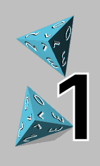 |
| 저속 주사위<br />(**0** × 4, **1** × 4, **2** × 2) | 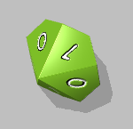 |
| 고속 주사위<br />(**2** × 2, **3** × 4, **4** × 4) | 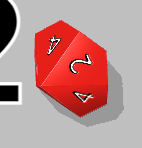 |
| 후진 주사위<br />(**-4** × 2, **-3** × 2, **-2** × 2, **-1** × 2, **1** × 2) | 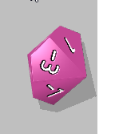 |
| 전진 주사위<br />(**1**, **2**, **3**, **4**) | 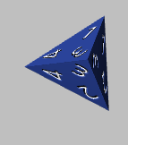 |
| 열쇠 주사위<br />(**앞** × 4, **뒤** × 4) | 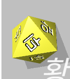 |
| 막고라 주사위<br />(**디맥** × 2, **투온** × 2, **식스타** × 2, **아르케아** × 2) | 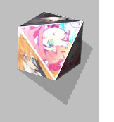 |
| 조커 주사위<br />(**4** × 4, **0** × 2, **-4** × 4) | 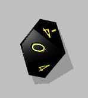 |
| 모서리 주사위<br />(**왼쪽 아래** × 2, **왼쪽 위** × 2, **오른쪽 위** × 2) | 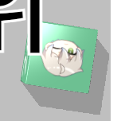 |

- **페이즈 도전 기능이 추가**되었습니다.
  - 출발을 지날 때마다 페이즈 도전 버튼을 클릭하여 **현재 페이즈에 도전**할 수 있습니다.
  - 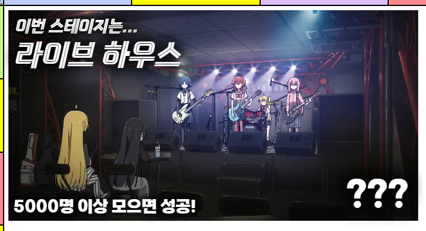
  - 규칙이 변경됨에 따라 **퇴근 조건이 3페이즈 통과**로 변경됩니다.
- **직전 곡 추첨 취소 기능이 추가**되었습니다. (임시)
  - 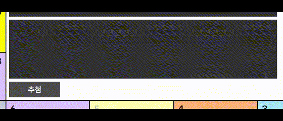
  - "직전 추첨 취소" 버튼을 클릭하여 마지막으로 추첨된 선곡을 취소할 수 있습니다.
  - **\[주의!]** 추첨되면서 제외된 **다른 선곡들은 <ins>돌아오지 않습니다</ins>**.
  - "직전 추첨 취소" 버튼은 **클릭하는 즉시 적용**됩니다. (추후, 확인 과정을 추가할 예정입니다.)
  - 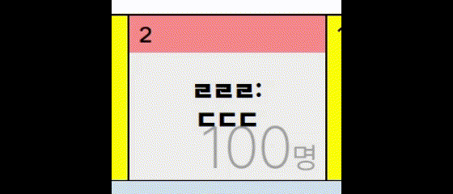
  - 직전 곡의 추첨이 취소되는 경우, 해당 곡이 추첨된 주제의 **밟은 횟수가 1 감소**합니다.
    - 라인 독점 상태에서 직전 곡 추첨 취소 기능을 사용하여 **어느 한 칸의 밟은 횟수가 0**이 되는 경우 <ins>**즉시 라인 독점이 풀립니다**</ins>.

### Ver.1.4

- 주사위가 2D에서 3D로 변경되었습니다.
  - 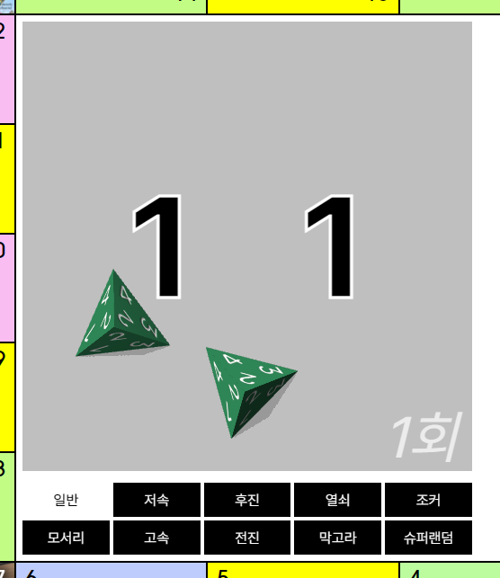
  - 주사위를 별도의 주사위 모듈 임베딩에서 WASM 임베딩으로 변경하였습니다.
  - 이제 주사위를 직접 굴려서 결과를 확인할 수 있습니다. 화면을 클릭하면 주사위가 랜덤한 위치에서 굴러갑니다.
  - 일부 특수 주사위의 종류가 다음과 같이 변경되었습니다.
    - **5면체 주사위** (저속, 후진, 조커, 모서리, 고속) => **10면체 주사위** (D5 모델이 없어서)
    - **일부 4면체 주사위** (열쇠, 막고라) => **8면체 주사위** (긴장감 조성 목적)
  - 일반 주사위가 **4면체 주사위** (0, 1, 2, 3) **두개**로 변경됩니다.
- 황금열쇠가 돌림판에서 슬롯머신으로 변경되었습니다.
  - 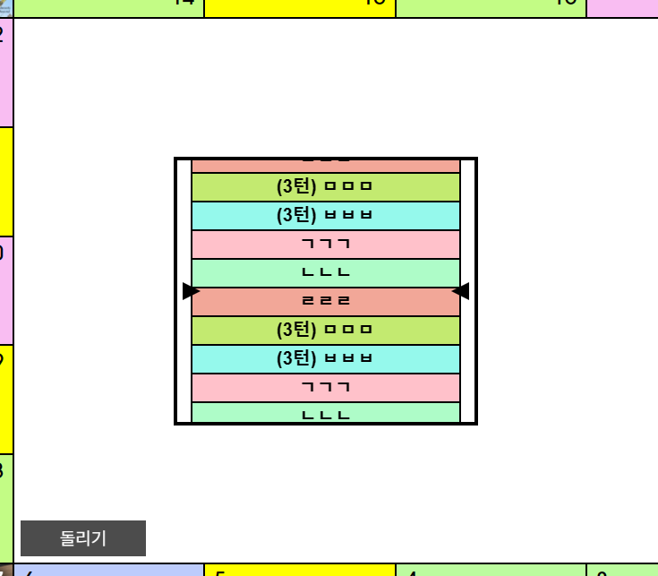
  - 이제 **대기 상황에서도** 황금열쇠는 **천천히 돌아갑니다**.

### Ver.1.3

- "턴"과 "곡"이 다시 하나로 합쳐졌습니다.
  - 주사위 관련 황금열쇠 항목(예: "3턴간 더블 주사위 (더블시 이동 불가)")이 더이상 없는 관계로 **"곡"이 삭제**되었습니다.
  - 턴 감소 버튼의 기능이 추첨 결정 버튼으로 이동되었습니다.
- 자낳괴 옵션 추가
  - 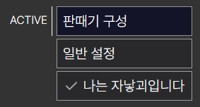
  - "나는 자낳괴입니다" 버튼을 클릭하는 것으로 켜고 끌 수 있습니다.
  - 투네이션 룰렛을 받으면 **1000원에 1포인트씩 퇴근 조건치(기본 1000딸라)가 증가**합니다.
- 시작화면 UI 개편
  - **더이상 모달 형태로 띄우지 않고 판때기 중앙을 꽉차게 씁니다**.
  - 인게임 판때기 중앙 UI와 테마를 맞추어 화려함 대신 모던함을 챙겼습니다.
- 버그픽스: 더 이상 **추첨 도중에는 이동이 허용되지 않습니다**.
  - 추첨 도중에 다른 칸을 클릭하면 해당 칸의 주제가 표시되는 문제 수정
  - 추첨 도중에 다른 칸에서 결정 버튼을 누르면 해당 칸에 표시된 만큼의 포인트를 획득하는 문제 수정
- 판때기 칸 추가/변경
  - 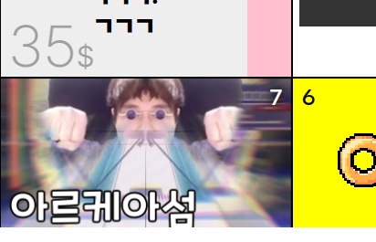
  - 무인도: **아르케아섬** (NEW!)
  - 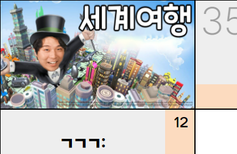
  - 뱅하싶 => **세계여행**

### Ver.1.2.beta

- 황금열쇠 예약어가 간략화 되었습니다.
  - `n턴간 ...` => `(n턴) ...`
  - `n곡동안 ...` => `(n곡) ...`
  - `... (n회)` => `(n개) ...`
    - 또한, 이제 (n개) 항목들은 **중첩이 가능**합니다.
- 화폐 시스템이 추가되었습니다.
  - 
  - 이제 추첨 결정 버튼을 클릭하면 자동으로 **해당 칸에 명시된 만큼 돈이 들어옵니다**.
  - 처음 밟으면 35$, 두번째로 밟으면 25$, 세번째부터는 15$로 가격이 고정됩니다.
    - 단, 라인 독점 시 (해당 라인에 모든 일반 칸을 한번 이상 밟았을 경우) 30$로 고정됩니다.
  - +/-를 클릭하는 것으로 수동으로 조절할 수 있습니다.

### Ver.1.1.beta (Special Thanks: [hibiya](https://github.com/hibiyasleep))

- UI가 상당부분 모던하게 개선되었습니다. 
- 출발 칸의 용도가 변경되었습니다.
  - 기존 출발 칸의 기능은 별도의 **판때기 메뉴** 버튼으로 옮겨졌습니다.
  - 이제 출발 칸을 클릭하면 **화면 중앙의 UI가 간소화**됩니다.
    - 황금열쇠, 곡 추첨창, 주사위, 인벤토리가 숨겨집니다.
    - 로그도 5개까지 표시됩니다.
  - 숨겨진 UI는 **출발 칸 이외의 칸**을 클릭하면 **다시 표시**됩니다.
- 배경이 투명해졌습니다.
  - 가독성 관련 이슈로 화면 중앙의 배경에 대한 내부 토론 결과, **상시 투명으로 두고 OBS 상에서 변경**하는 것으로 결론이 났습니다.
  - 해당 변경점 관련 내용은 [여기](https://tgd.kr/s/arpa__/70645560)를 참조해주세요.
- 이제 웹앱 상에서 읽어들일 트위치 챗 채널을 설정할 수 있습니다.
  - 이 변경점으로 인해 백금열쇠의 범용성이 증가하였습니다.

### Ver.1.0.beta (Special Thanks: [양치기양](https://github.com/ShepherdingSheep))

- 기존 [황금열쇠 MK3](https://github.com/smh0505/GoldenKeyMK3)의 기능 대부분을 Vue로 포팅했습니다.
  - **기존 개발환경**: C#
  - **현재 개발환경**: Typescript, Vue
- 플랫폼이 OpenGL을 포함한 콘솔 앱에서 웹앱으로 변경됨에 따라, ***주사위가 임베드되었습니다***.
  - 이제 **뱅하싶 칸을 클릭**하면 주사위가 나옵니다.

## 라이브러리 및 프레임워크

- Vite
- Vue
- Typescript
- Sass
- Pinia
- Vue-Konva
- Luxon
- LocalForage
- Fantastic Dice (3D Dice/Dice-Box)

## 빌딩

```shell
git clone https://github.com/smh0505/PlatinumKey.git
cd PlatinumKey
npm install
npm run dev
```

## 라이센스

이 웹앱은 [MIT 라이센스](./LICENSE)를 따르고 있습니다.

## Special Thanks

[김편집_](https://kimpyun.zip)\
[양치기양](https://github.com/ShepherdingSheep)\
[hibiya](https://github.com/hibiyasleep)\
[채팅_안치는사람](https://github.com/orphues12)\
[cannabee.](https://youtube.com/@cannabee)

**그리고 여러분**
